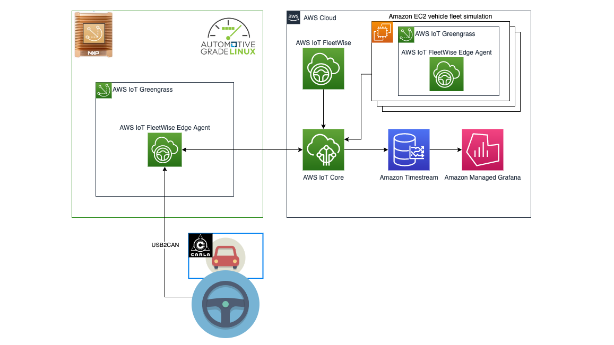

# AGL V2C Demo

This project demonstrates an implementation of the Vehicle to Cloud (V2C) project as part of the Automotive Grade Linux (AGL) Working Group. The V2C project aims to develop an MQTT client that interfaces with the kuksa.val platform for accessing vehicle signals and provides compatibility with AWS IoT, leveraging current standards for vehicle communication. Security is enforced through mTLS authentication.

For more information about the V2C project, please refer to the [project specification](https://confluence.automotivelinux.org/display/VTCEG/MQTT+Client+for+kuksa.val+and+AWS+IoT%3A+Project+Specification).

The implementation provided here is an example of using AWS IoT Core as well as Amazon Timestream and Amazon Managed Grafana.

## High-Level Architecture

The code in this repository represents the cloud part of the V2C project, while the device part is located in the AGL repository (link will be provided).



## Getting Started

After the init process completes and the virtualenv is created, you can use the following
step to activate your virtualenv.

```
$ source .venv/bin/activate
```

Once the virtualenv is activated, you can install the required dependencies.

```
$ pip install -r requirements.txt
```

At this point you can now synthesize the CloudFormation template for this code.

```
$ cdk synth
```

To add additional dependencies, for example other CDK libraries, just add
them to your `setup.py` file and rerun the `pip install -r requirements.txt`
command.

## Useful commands

 * `cdk ls`          list all stacks in the app
 * `cdk synth`       emits the synthesized CloudFormation template
 * `cdk deploy`      deploy this stack to your default AWS account/region
 * `cdk diff`        compare deployed stack with current state
 * `cdk docs`        open CDK documentation


### Setup Grafana

After deploying the stack as an output you will be provided with `AglV2CDemoStack.WorkspaceRoleToAssume`. 

This can then be used to create Amazon Managed grafana using the following command:

```
aws grafana create-workspace --account-access-type CURRENT_ACCOUNT --authentication-providers AWS_SSO --permission-type SERVICE_MANAGED --workspace-data-sources TIMESTREAM --workspace-role-arn <AglV2CDemoStack.WorkspaceRoleToAssume ARN>
```

### Device Provisioning
For device provisioning please refer to the documentation: https://docs.aws.amazon.com/iot/latest/developerguide/iot-provision.html

## License

This project is licensed under the [MIT License](LICENSE).


